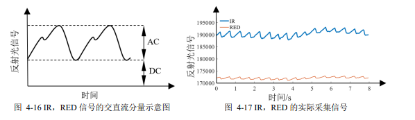
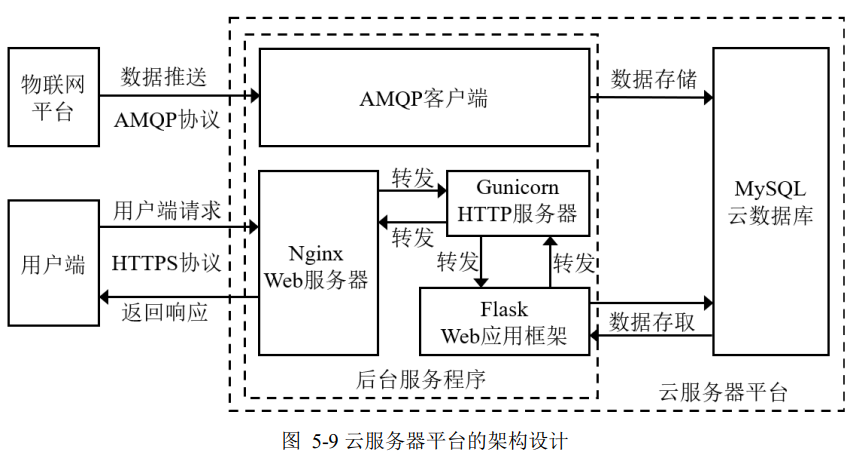
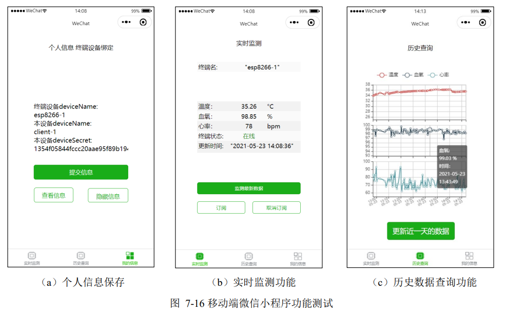

# Remote-Medical-Monitoring
> In this context, based on the Internet of things and other technologies, this paper studies a remote medical monitoring system that can monitor physical parameters through devices, store data in the cloud through the network, and finally display data on the user end. 
# About

The system includes four parts: terminal device, IoT platform, cloud server platform and user end. The following works are completed: 

(1) Firstly, the hardware design of the terminal device is completed. The software algorithm has been introduced for the measurement of physical parameters including temperature, heart rate and blood oxygen, and WiFi networking function. Through MQTT protocol, the communication between terminal device and IoT
platform is realized. 

(2) Secondly, the construction and deployment of the IoT platform is completed. The methods of terminal device access and message processing are designed, realizing the device management and message flow functions; 

(3) Thirdly, the construction and deployment of the cloud server was completed. The background service program and cloud database were constructed to implement the storage and query of historical monitoring data; 

(4) Then, the Web and WeChat remote medical monitoring platform is designed to achieve the visualization of real-time monitoring, remote control and historical data query. 

(5) Finally, the experiment of each part verifies the feasibility of the whole system
## Table of Contents
* [Part 1: Overall Architecture](#part-1-overall-architecture)
* [Part 2: Terminal Device](#part-2-terminal-device)
* [Part 3: Cloud Platform](#part-3-cloud-platform)
* [Part 4: Client](#part-4-client)
<!-- * [License](#license) -->

## Part 1: Overall Architecture
The system includes four parts: terminal device, IoT platform, cloud server platform and client.

## Part 2: Terminal Device
The terminal equipment is mainly divided into five parts: main control module, temperature module, blood oxygen and heart rate module, display module, and power module.

ESP12-F, as the main control device, communicates with slave devices such as temperature module, blood oxygen and heart rate module, and display module through ports that support I2C protocol. 

      

### HR（heart rate）and SpO2 algorithm
The photoelectric volume pulse wave tracing method adopted in this paper utilizes the differences in light reflectivity between two proteins. Red light with a wavelength of 660nm and infrared light with a wavelength of 940nm are used to irradiate the human skin (finger tip), and different reflected light signals from the two proteins are obtained through a heart rate and blood oxygen module.

#### HR algorithm
This project uses peak monitoring in the time-domain method to achieve the calculation of heart rate. Select RED signal as the analysis target.

$$ HR=\frac{60(p_n-1)}{\Delta t} $$

$p_n$ denotes the number of times a wave peak appears per unit time, and $\Delta t$ denote the interval time between the occurrence of one peak and the last peak within a unit time.

#### SpO2 algorithm
The calculation of blood oxygen saturation requires a comprehensive use of the DC and AC components of the RED and IR raw signals, and is calculated through empirical calibration formulas. Let the DC and AC components obtained by irradiating red light are $RED_{DC}$ and $RED_{AC}$, respectively, and the DC and alternating AC obtained by irradiating infrared light are $IR_{DC}$ and $IR_{AC}$, respectively, a equation is as follows:

$$R=\frac{RED_{AC}/RED_{DC}}{IR_{AC}/IR_{DC}}$$

For the convenience of processing, the mean of the original signal is taken as the DC component of the signal; Take the difference between the original signal and the DC component, and use the root mean square of the difference as the AC component of the signal. Therefore, the above formula can be rewritten as:

$$R=\frac{RED_{rms}/RED_{mean}}{IR_{rms}/IR_{mean}}$$

And SpO2 can be calculated by the following equation：

$$SpO2 = A\times R^{2}+B\times R + C$$

The calibration values of A, B and C can be obtained from **Maxim Integrated Products, Inc.**, where A=− 45.06, B=30.354 and C=94.845.

## Part 3: Cloud Platform
Cloud platform includes two parts: IoT platform and cloud server.

This project selects MQTT as the communication method between terminal devices and IoT platforms, as well as the communication method between mobile devices and IoT platforms in the user end.
The Alibaba Cloud IoT platform only has short-term data storage capabilities, so AMQP protocol is chosen to push IoT platform data to cloud servers for long-term storage.

The cloud server platform mainly consists of two parts: the backend service program and the MySQL cloud database. The backend service program adopts the Nginx+Gunicorn+Flask server framework, and utilizes the HTTPS protocol to receive and process user requests.

      

## Part 4: Client
The client built by WeChat mini program mainly provides remote monitoring function for designated patients, which is mainly divided into personal information function page, historical query function page, and real-time monitoring function page

