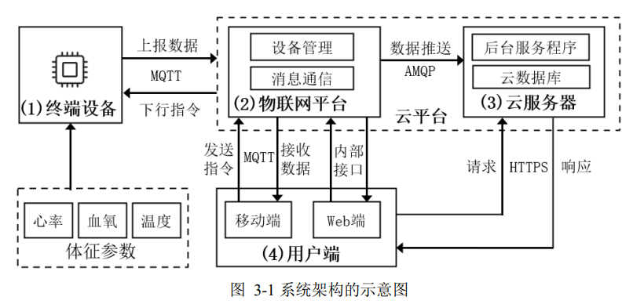
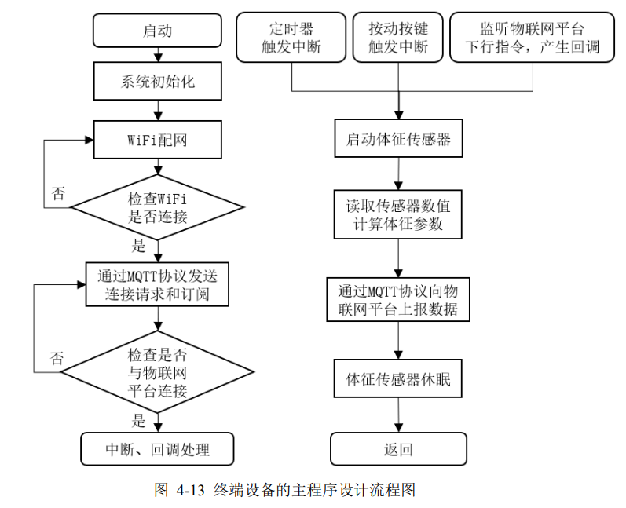
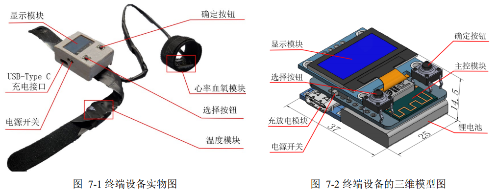
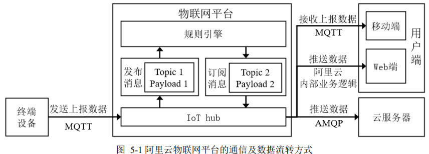

# Remote-Medical-Monitoring
> In this context, based on the Internet of things and other technologies, this paper studies a remote medical monitoring system that can monitor physical parameters through devices, store data in the cloud through the network, and finally display data on the user end. 
# About

The system includes four parts: terminal device, IoT platform, cloud server platform and user end. The following works are completed: 

(1) Firstly, the hardware design of the terminal device is completed. The software algorithm has been introduced for the measurement of physical parameters including temperature, heart rate and blood oxygen, and WiFi networking function. Through MQTT protocol, the communication between terminal device and IoT
platform is realized. 

(2) Secondly, the construction and deployment of the IoT platform is completed. The methods of terminal device access and message processing are designed, realizing the device management and message flow functions; 

(3) Thirdly, the construction and deployment of the cloud server was completed. The background service program and cloud database were constructed to implement the storage and query of historical monitoring data; 

(4) Then, the Web and WeChat remote medical monitoring platform is designed to achieve the visualization of real-time monitoring, remote control and historical data query. 

(5) Finally, the experiment of each part verifies the feasibility of the whole system
## Table of Contents
* [Part 1: Overall Architecture](#part-1-overall-architecture)
* [Part 2: Terminal Device](#part-2-terminal-device)
* [Part 3: Cloud Platform](#part-3-cloud-platform)
* [Lecture 4: Optimization Pt. 2](#lecture-4-optimization-pt-2)
* [Lecture 5: Optimization Pt. 3](#lecture-5-optimization-pt-3)
* [WordNet](#wordnet)
* [Seam Carving](#seam-carving)
* [Baseball Elimination](#baseball-elimination)
* [Boggle](#boggle)
* [Burrows Wheeler](#burrows-wheeler)
* [Contact](#contact)
<!-- * [License](#license) -->

## Part 1: Overall Architecture

## Part 2: Terminal Device

      

## Part 3: Cloud Platform

## Part 4:
